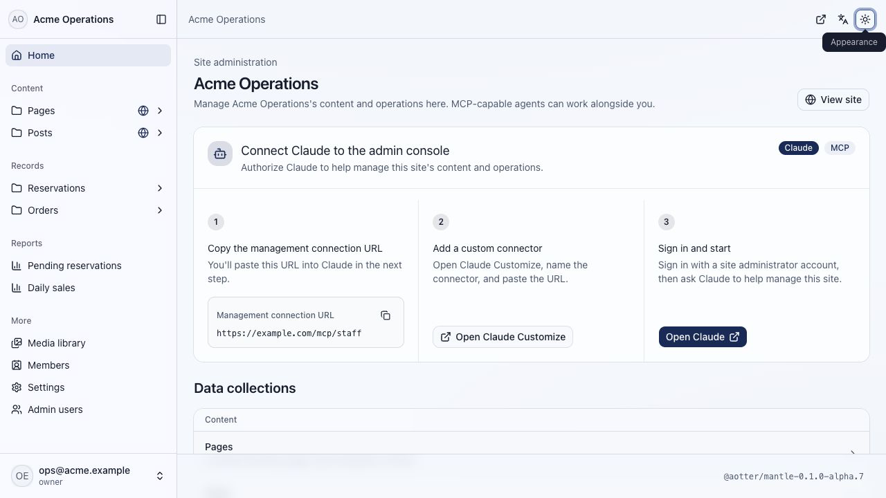
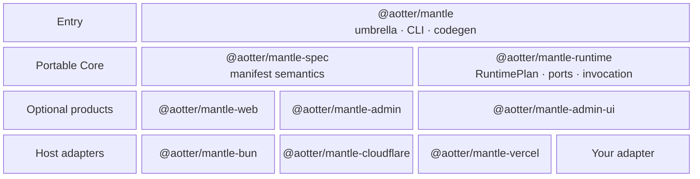

<h1 align="center">Mantle</h1>

<p align="center">
  <em>Be the dungeon master. Don’t code every corridor.</em>
</p>

<p align="center">
  
</p>

<p align="center">
  <strong>Schema. View. Procedure. Trigger. Four atoms from which your world takes shape.</strong><br>
  Speak it in plain YAML, and the dungeon wakes—whole, lit from within, and yours to command.
</p>

<p align="center">
  <a href="https://github.com/aotter/mantle/actions/workflows/ci.yml"></a>
  <a href="https://github.com/aotter/mantle/stargazers"></a>
  <a href="https://www.npmjs.com/package/@aotter/mantle"></a>
  <a href="https://github.com/aotter/mantle/releases"></a>
  <a href="https://nodejs.org/"></a>
  <a href="LICENSE"></a>
</p>

<p align="center">
  <a href="#one-manifest-one-contract">Quick start</a>
  &middot;
  <a href="#a-custom-mcp-server-without-building-the-server">Why Mantle</a>
  &middot;
  <a href="#architecture">Architecture</a>
  &middot;
  <a href="#develop-with-mantle">Develop</a>
  &middot;
  <a href="#cli-reference">CLI</a>
</p>

<p>
  <sub><strong>Prerelease:</strong> APIs and manifests may change between alpha releases. Treat the installed package's version-matched docs as the contract and review generated code before production use.</sub>
</p>

# Agent-built. Agent-operated.

AI can build a convincing interface. The harder problem is the contract under
it—and the operating surface left after launch.

Describe Schema, View, Procedure, and Trigger once. Mantle links and validates
them into one RuntimePlan for typed TypeScript, REST, OpenAPI, MCP, Web, and
Admin. Coding agents build with it; operation agents run it through governed
tools. It stays inside your application, with your storage, auth, queues, and
lifecycle.

## One manifest, one contract

1. Describe your project in `manifests/reservations.yml`:

   ```yaml
   # excerpt — see the complete manifest reference below
   apiVersion: cms.mantle.aotter.net/v1
   kind: Schema
   metadata:
     name: slots
   spec:
     lifecycle: operational
     schema:
       type: object
       properties:
         state: { type: string, enum: [available, reserved] }
         # ...
   ---
   apiVersion: cms.mantle.aotter.net/v1
   kind: View
   metadata:
     name: available-slots
   spec:
     surface: public
     from: slots
     filter:
       eq: { field: state, value: available }
     # ...
   ---
   apiVersion: cms.mantle.aotter.net/v1
   kind: Procedure
   metadata:
     name: request-reservation
   spec:
     input:
       type: object
       required: [slotId, email]
       properties:
         slotId: { type: string }
         email: { type: string, format: email }
       # ...
     output:
       type: object
       properties:
         queued: { type: boolean }
     handler: { kind: ref, ref: queue-reservation-request }
   ---
   apiVersion: cms.mantle.aotter.net/v1
   kind: Trigger
   metadata:
     name: request-reservation-mcp
   spec:
     source: { kind: mcp, surface: public }
     target: { procedure: request-reservation }
   ```

   See the [complete manifest reference](docs/design-atoms.md) for the full syntax.

2. Install Mantle and generate the typed runtime binding:

   ```bash
   pnpm add @aotter/mantle@alpha
   pnpm exec mantle generate
   ```

3. Give the generated binding your
   [storage adapter](docs/adapter-guide.md):

   ```ts
   import {
     createMantle,
     type MantleHandlers,
   } from "./.mantle/generated/mantle.js";

   interface Env {
     RESERVATION_QUEUE: {
       send(message: { slotId: string; email: string }): Promise<void>;
     };
   }

   const handlers = {
     "queue-reservation-request": async ({ slotId, email }, ctx) => {
       await ctx.env.RESERVATION_QUEUE.send({ slotId, email });
       return { queued: true };
     },
   } satisfies MantleHandlers<Env>;

   const mantle = await createMantle({ storage, handlers });

   // The `available-slots` View becomes a typed lower-camel property.
   const slots = await mantle.views.availableSlots();
   ```

4. That's it: the View is a typed query, the Procedure is your typed handler,
   and the Trigger exposes it as an MCP tool. Platform adapters own lifecycle
   policy, while `mantle.runtime` keeps lower-level capabilities within reach.

## A custom MCP server, without building the server

Views become read tools. Procedures backed by your own handlers become typed
action tools when exposed by MCP Triggers. At `/mcp/staff`, authorized teammates
can operate queues, Slack, email, ERP, CRM, or anything else your handler can
reach—without maintaining a second MCP server or schema.

## Agent-discoverable and i18n-ready, built in

Enable the optional Web surface and every public page gets a predictable path
and Markdown mirror in every locale:

```text
/en/posts/hello
/en/posts/hello.md
/zh-tw/posts/hello
```

Mantle also emits `llms.txt`, sitemap, canonical links, hreflang, JSON-LD, and
social metadata from the same published state.

## Publishing and operations in one Admin

Publishing content gets draft, publish, unpublish, and archive. Operational
records such as orders, inventory, and reservations stay live without a fake
publishing state machine. Add the optional Admin API and React SPA when humans
need the same controls; editorial review and approval are coming soon.



## Open source, host-owned, ready to ship

Apache-2.0 Core runs inside your process, with the raw Runtime and handler
context available for transactions, queues, media, and platform capabilities.
Use Bun, Vercel, Cloudflare, or your own adapter; start from
[Blank, Presence, Intake, Publication, Transaction, or
Reservation](https://github.com/aotter/mantle-starters). Membership and
Community are coming soon. Small Cloudflare sites can fit within its
[Workers](https://developers.cloudflare.com/workers/platform/pricing/) and
[D1](https://developers.cloudflare.com/d1/platform/pricing/) free limits.

## Architecture

Manifests compile once into a sealed RuntimePlan. Packages compose outward
from the portable Core; Core never depends on optional products or host
adapters.



Mantle is named for the living tissue that grows a mollusk's shell: it adds
structure around the application you already own.

## Develop with Mantle

### Human engineers

Human engineers get the same direct path: ordinary YAML in, ordinary
TypeScript APIs out.

```bash
pnpm add @aotter/mantle@alpha
```

Author and review manifests directly, use Spec without Runtime, implement
semantic ports over existing storage, or compose generated bindings and
optional packages. The [umbrella package README](packages/mantle/README.md) is
the installed API guide; adapter authors start with the
[adapter guide](docs/adapter-guide.md).

### Coding agents

This repository has a second entrance: it is an installable agent plugin bundle
for Claude Code, Codex, Cursor, and GitHub Copilot. The plugin carries
version-matched Mantle workflows; it is an authoring aid, not a Runtime
dependency.

Use an immutable tag matching the installed package version:

```bash
# Claude Code — run as two separate prompts
/plugin marketplace add aotter/mantle@v<installed-version>
/plugin install mantle@mantle

# Codex
codex plugin marketplace add aotter/mantle --ref v<installed-version>
codex plugin add mantle@mantle
```

Cursor and GitHub Copilot discover their plugin manifests when this repository
is cloned or opened. See [`skills/README.md`](skills/README.md) for host details.

- **Repository plugin:** teaches an agent to create and maintain Mantle
  projects.
- **`mantle skills`:** projects the installed package's exact `develop`,
  `plugin`, `theme`, and `update` workflows into a consumer repository.

## CLI reference

The umbrella provides one `mantle` command set:

| Command | Purpose |
|---|---|
| `mantle generate` | Compile manifests into a sealed plan and typed runtime module. |
| `mantle generate --check` | Fail without writing when generated code is stale. |
| `mantle validate` | Validate manifests and handler-source references. |
| `mantle introspect` | Print the parsed manifest tree as JSON. |
| `mantle emit-openapi` | Emit OpenAPI 3.1 from HTTP Triggers and View routes. |
| `mantle emit-types` | Emit TypeScript declarations from Schemas, Procedures, and Views. |
| `mantle skills` | Project version-matched Core skills into the consumer repository. |
| `mantle update --ref <ref>` | Compare local work with an immutable provision bundle; apply nothing. |

Run commands through the project's package manager, for example
`pnpm exec mantle generate`.

`generate` writes one `.mantle/generated/mantle.ts` module containing the
sealed plan, generated types, `createMantle`, and `bindMantle`. It does not
install Admin, change styling, project skills, provision providers, or deploy
the application.

## Contributing

- [`CONTRIBUTING.md`](CONTRIBUTING.md) is the contributor and architecture
  authority for humans and agents.
- [`docs/adr/`](docs/adr/) records accepted, path-dependent decisions.
- [`docs/release-process.md`](docs/release-process.md) governs releases.
- [GitHub Releases](https://github.com/aotter/mantle/releases) is the canonical
  public change history.

Apache 2.0. See [`LICENSE`](LICENSE).
