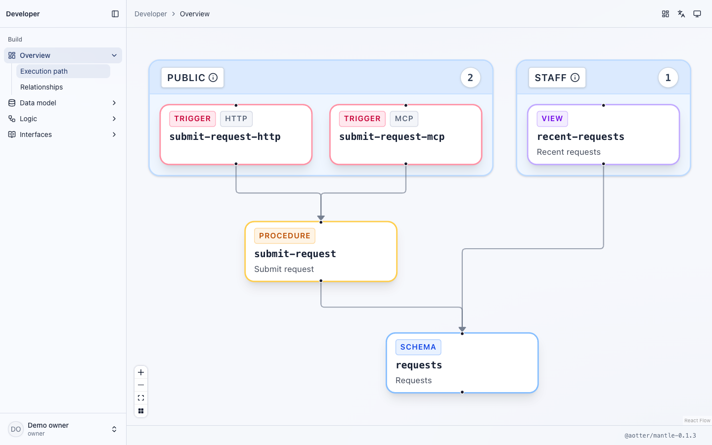

<h1 align="center">Mantle</h1>

<p align="center">
  <em>Be the dungeon master. Don’t code every corridor.</em>
</p>

<p align="center">
  
</p>

<p align="center">
  <strong>Schema. View. Procedure. Trigger. Four atoms from which your world takes shape.</strong><br>
  Speak it in plain YAML, and the dungeon wakes—whole, lit from within, and yours to command.
</p>

<p align="center">
  <a href="https://github.com/aotter/mantle/actions/workflows/ci.yml"></a>
  <a href="https://github.com/aotter/mantle/stargazers"></a>
  <a href="https://www.npmjs.com/package/@aotter/mantle"></a>
  <a href="https://github.com/aotter/mantle/releases"></a>
  <a href="https://nodejs.org/"></a>
  <a href="LICENSE"></a>
</p>

<p align="center">
  <a href="#features">Features</a> &middot;
  <a href="#admin-for-people-and-agents">Admin</a> &middot;
  <a href="#get-started">Get started</a> &middot;
  <a href="#documentation">Documentation</a> &middot;
  <a href="docs/examples/README.md">Examples</a>
</p>

Mantle is an embeddable application engine for TypeScript. Define your data,
queries, actions, and triggers in a Manifest, then use them through typed APIs,
HTTP endpoints, agent tools, and an optional staff console.

Build a publishing site, an internal operations app, or an API for agents.
Your application owns its host, storage, and business logic; choose the Mantle
modules you need.

## Features

- **One Manifest, connected interfaces.** Schema, View, Procedure, and Trigger
  describe your data and behavior. The compiled definitions power typed APIs,
  HTTP routes, MCP tools, and Admin. [Manifest features](docs/handbook/reference/features.md).
- **Typed queries and actions.** Generate TypeScript bindings for entries,
  declarative Views, and Procedures. Keep host-only reads private with internal
  Views. [Typed queries](docs/handbook/guides/typed-queries.md).
- **Admin that follows your model.** Manage live records, publish content, run
  reports, and invoke business actions. Configure columns, filters, and actions
  with Manifest `uiSchema`. [Admin customization](docs/handbook/guides/admin-ui.md).
- **Tools for browser and remote agents.** Admin supports WebMCP using the
  signed-in staff session. Remote MCP clients connect through authenticated
  endpoints, with authorization checked on each call.
  [MCP and WebMCP](docs/handbook/concepts/mcp-and-agents.md).
- **Publishing and discovery.** Add localized HTML and Markdown, draft/publish
  workflows, `llms.txt`, sitemaps, and search/social metadata.
  [Publishing example](docs/examples/builtin-publication.md).
- **Embed in an existing application.** Use validation alone, connect Runtime
  to your storage, or add Web, Admin, and a host adapter.
  [Integration choices](#choose-how-much-to-use).

## Admin for people and agents

Give staff a workspace for content, operational records, reports, and actions.
In browsers supporting WebMCP, agents can discover and invoke staff tools from
Admin, inspect the current page, and navigate alongside the user. Calls use the
current staff session and retain server-side authorization and concurrency checks.


### Developer UI and application API docs

Explore your application's Schemas, Views, Procedures, Triggers, and their
relationships in the owner-only Developer UI. Its HTTP, MCP, and WebMCP docs
show the application's projected routes and tool schemas, with links back to
the owning definitions.



*Developer UI rendered locally from the intake example. The graph describes
compiled declarations; it does not certify runtime or deployment health.*

| Interface | Where to explore it | Integration guide |
|---|---|---|
| HTTP | Admin → Developer → API (`/admin/dev/docs/api`) | [HTTP API](docs/handbook/concepts/procedures-and-triggers.md) |
| Remote MCP | Admin → Developer → MCP (`/admin/dev/docs/mcp`) | [Endpoints, tools, and authentication](docs/handbook/concepts/mcp-and-agents.md) |
| Browser WebMCP | Admin → Developer → WebMCP (`/admin/dev/docs/webmcp`) | [Admin and public-page WebMCP](docs/handbook/concepts/mcp-and-agents.md#webmcp-in-the-browser) |

## A Manifest in practice

An intake application needs request records, a submission action, and a staff
inbox. Its staff View can be as small as:

```yaml
apiVersion: cms.mantle.aotter.net/v1
kind: View
metadata:
  name: recent-requests
spec:
  title: Recent requests
  surface: staff
  from: requests
  fields: [id, name, email, message, submittedAt]
  orderBy:
    - { field: submittedAt, direction: desc }
  limit: 50
```

Together with the `requests` Schema, this defines the read used by the staff
report and its MCP tool. A Procedure handles submissions, with Triggers choosing
HTTP and MCP exposure. [Read the complete intake example](docs/examples/builtin-intake.md).

For other applications, explore [commerce](docs/examples/builtin-commerce.md),
[reservations](docs/examples/builtin-reservation.md), and
[procurement](docs/examples/builtin-procurement.md).

## Get started

### With a coding agent

Install the Mantle skill to get guided setup for your application and the
features you need:

```sh
npx skills add aotter/mantle
```

Ask your agent to follow the installed skill and describe what you want to build.
The installer finds the `mantle` skill by name.
See the [agent setup guide](docs/handbook/guides/agent-setup.md) for supported
editors, plugins, and project instructions.

### Build it yourself

Start with the [handbook](docs/handbook/start/overview.md), or follow the
[runnable minimal Worker](docs/examples/host-minimal-worker/README.md).
For a staff console, use the [local Admin example](docs/examples/host-local-admin-otp/README.md).
The [project and CLI guide](docs/handbook/start/project-and-cli.md) walks through
installation, authoring Manifests, generating typed bindings, and verification.

Using ChatGPT Sites? Follow the [Sites integration](docs/handbook/chatgpt-sites/index.md)
for content management, sign-in, media, and publishing.

## Choose how much to use

| Start with | Add when you need |
|---|---|
| [Spec](docs/spec-only-host-adoption.md) | Manifest parsing, validation, and introspection in an existing system. |
| [Runtime + typed APIs](packages/mantle/README.md) | Queries and actions backed by your storage and handlers. |
| [A host adapter](docs/adapter-guide.md) | HTTP and other supported transports on your chosen platform. |
| [Web](packages/mantle-web/README.md) | Public HTML, Markdown, localization, and discovery metadata. |
| [Admin](docs/handbook/guides/admin-ui.md) | A staff API and prebuilt console with Manifest-driven rendering. |
| [Auth](packages/mantle-auth/README.md) | Identity, staff roles, and OAuth / MCP authorization. |

Cloudflare is the supported host for the integrated Auth, Admin, and MCP
experience. Bun and Vercel adapters are experimental; they support public Views
and HTTP Triggers, with authentication and CSRF owned by the host.
[Compare adapters](docs/adapter-guide.md).

<details>
<summary>Package reference</summary>

| Package | Purpose |
|---|---|
| `@aotter/mantle` | Core umbrella, CLI, and code generation. |
| `@aotter/mantle-spec` | Manifest parsing, validation, and introspection. |
| `@aotter/mantle-runtime` | Runtime execution and storage ports. |
| `@aotter/mantle-web` | Public rendering and discovery metadata. |
| `@aotter/mantle-admin` | Admin API and session integration. |
| `@aotter/mantle-admin-ui` | Prebuilt staff console and Developer UI. |
| `@aotter/mantle-auth` | Identity, roles, and OAuth authorization. |
| `@aotter/mantle-indexeddb` | Browser-local storage. |
| `@aotter/mantle-cloudflare` | Workers, D1, and integrated surfaces. |
| `@aotter/mantle-bun` | Experimental Bun adapter. |
| `@aotter/mantle-vercel` | Experimental Vercel adapter. |

</details>

## Documentation

- [Handbook](docs/handbook/start/overview.md) — concepts, setup, and task guides.
- [Manifest feature reference](docs/handbook/reference/features.md) — capabilities and their authoring fields.
- [SDK and package API](packages/mantle/README.md) — installation, typed bindings, and optional modules.
- [CLI guide](docs/handbook/start/project-and-cli.md) — validate, generate, and maintain a project.
- [Examples](docs/examples/README.md) — complete Manifests and runnable hosts.
- [Releases](https://github.com/aotter/mantle/releases) — changes and upgrade notes.

## Contributing

See [Contributing](CONTRIBUTING.md) for development and review,
[Support](SUPPORT.md) for questions and bugs, and [Security](SECURITY.md) for
private vulnerability reports. Contributors follow the
[Code of Conduct](CODE_OF_CONDUCT.md).

Apache 2.0. See [LICENSE](LICENSE).
